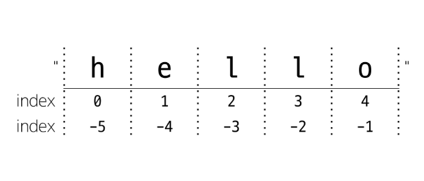

# 7월 15일 Python

## 1. 프로그래밍
- 새 연산을 정의하고 조합해 유용한 작업을 수행하는 것
- ***문제를 해결***하는 매우 강력한 방법
----------

## 2. 프로그래밍 언어
- 컴퓨터에게 작업을 지시하고 문제를 해결하는 도구
 ----------- 

## 3. Python

### 3-1. Python을 배우는 이유
- 쉽고 간결한 문법
  - 읽기 쉽고 쓰기 쉬운 문법

- 파이썬 커뮤니티의 지원
  - 세계적인 규모의 온라인 포럼 및 커뮤니티
  
- 광범위한 응용 분야
  - ex) 웹, 앱, 데이터 분석, 인공지능

### 3-2. Python이 실행되는 과정

- 인터프리터가 사용자의 명령어를 운영체제가 이해하는 언어로 바꿈
---------

## 4. 파이썬 소개

### 4-1. 파이썬을 계산기로 사용하기
```python
>>> 2 + 2
4
>>> 50 - 5*6
20
>>> (50 - 5*6) / 4
5.0
>>> 8/5
1.6
```
- 정수는 int형
- 소수가 있는 것들은 float형

```python
>>> 17 / 3  # classic division returns a float
5.666666666666667

>>> 17 // 3  # floor division discards the fractional part
5

>>> 17 % 3  # the % operator returns the remainder of the division
2

>>>5 * 3 + 2  # floored quotient * divisor + remainder
17
```

- 파이썬에서는 거듭제곱을 계산할 때 **연산자 사용
```python
>>> 5 ** 2
25
>>> 2 ** 7
128
```

- 변수에 값을 대입할 때는 등호(=)를 사용
```python
>>> width = 20
>>> height = 5 * 9
>>> width * height
900
#변수가 정의되어 있지 않을 때는 에러를 생성
```

### 4-2. 텍스트
- 파이썬을 숫자뿐만 아니라 텍스트도 조작 가능
```python
>>> 'spam eggs'
spam eggs
>>> '1975' #숫자도 문자형으로 가능
1975
```

#### Escape
- \\(백슬래시) 뒤에 문자나 숫자가 오는 조합을 이스케이프 시퀀스(Escape Sequence)라고 함. 


- 문자열은 +연산자로 이어붙이고, *연산자로 반복 가능.
```python
>>> 3 * 'do' + 'hyeong'
dododohyeong
```

- 문자열은 인덱스 될 수 있음.
```python
>>> word = 'python'
>>> word[0]
p
>>> word[1:2]
yt
>>> word[-1]
n
>>> word[-2]
o
>>> word[::2]
pto
>>> word[::-1]
nohtyp
>>> word[:2] + word[2:]
python
>>> word[5:42] #범위를 벗어나는 수는 부드럽게 처리됨.
n
```


- 내장함수 len은 문자열의 길이를 return
```python
>>> len('abc')
3
```
------

## 5. 부동소수점 에러
- 컴퓨터가 실수를 표현하는 방식으로 인해 발생하는 오차
- 원인
  - 실수를 2진수로 변환하는 과정에서 발생하는 근사치 표현
- 해결척
  - 대표적으로 decimal 모듈을 사용해 부동소수점 연산의 정확성을 보장하는 방법
```python
#해결 전
a = 3.2 - 3.1
b = 1.2 - 1.1

print(a) #0.100000000...9
print(b) #0.099999999...87
pritn(a == b) #False

#해결 후
from decimal import Decimal

a = Decimal('3.2') - Decimal('3.1')
b= Decimal('1.2') - Decimal('1.1')

print(a) #0.1
print(b) #0.1
print(a==b) # True
```
------