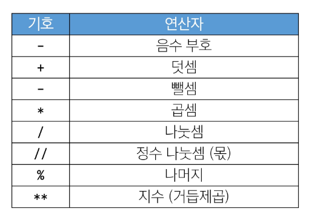

# 7월 16일 TIL

## 1. Sequence Types
- 순서(Sequence)
  - 값들이 순서대로 저장(정렬X)
- 인덱싱(Idexing)
  - 각 값에 고유한 인덱스(번호)를 가지고 있으며, 인덱스를 사용하여 특정 위치의 값을 선택하거나 수정할 수 있음
- 슬라이싱(Slicing)
  - 인덱스 범위를 조절해 부분적인 값을 추출할 수 있음
- 길이(Length)
  - len() 함수를 사용하여 저장된 값의 개수(길이)를 구할 수 있음
- 반복(Iteration)
  - 반복문을 사용하여 저장된 값들을 반복적으로 처리할 수 있음

## 2. str(문자열)
- 문자들의 순서가 있는 변경 불가능한 시퀀스 자료형
- Escape sequence
  - \n = 줄바꿈
  - \t = 탭
  - \\ = 백슬래시
  - \' = 작은 따옴표
  - \" = 큰 따옴표
- 인덱스
  - 시퀀스 내의 값들에 대한 고유한 번호로, 각 값의 위치를 식별하는데 사용되는 숫자


## 3. list
- 여러 개의 값을 순서대로 저장하는 변경 가능한 시퀀스 자료형

### 3-1. 리스트 표현
- 0개 이상의 객체를 포함하며 데이터 목록을 저장
- 대괄호([])로 표기
- 데이터는 어떤 자료형도 저장할 수 있음
```Python
my_list_1 = []
my_list_2 = [1, 'a', 3, 'b', 5]
my_list_3 = [1, 2, 3, 'Python', ['hello', 'world', '!!!']]

#인덱싱
my_list = [1, 'a', 3, 'b', 5]

print(my_list[1]) # a

#슬라이싱
print(my_list[2:4]) # [3, 'b']
print(my_list[:3]) # [1, 'a', 3]
print(my_list[3:]) # ['b', 5]
print(my_list[0:5:2]) # [1, 3, 5]
print(my_list[::-1]) # [5, 'b', 3, 'a', 1]

# 길이
print(len(my_list)) # 5
```

### 3-2. 리스트는 가변 (변경 가능)
```python
my_list = [1, 2, 3]
my_list[0] = 100

print(my_list) # [100, 2, 3]
```

## 4. tuple
- 여러 개의 값을 순서대로 저장하는 변경 불가능한 시퀀스 자료형

### 4-1. 튜플 표현
- 0개 이상의 객체를 포함하며 데이터 목록을 저장
- 소괄호(())로 표기
- 데이터는 어떤 자료형도 저장할 수 있음
  
### 4-2. 튜플은 불변 (변경 불가)
```python
my_tuple = (1, 'a', 3, 'b', 5)

#TypeError
my_tuple[1] = 'z'
```

### 4-3. 튜플은 어디에 쓰일까?
- 튜플의 불변 특성을 사용한 안전하게 여래 개의 값을 전달, 그룹화, 다중 할당 등
- ***개발자가 직접 사용하기 보다 '파이썬 내부 동장'에서 주로 사용됨***

## 5. range
- 연속된 정수 시퀀스를 생성하는 변경 불가능한 자료형

### 5-1. range 표현
- range(시작 값, 끝 값, 증가 값)
- range(n)
  - 0부터 n-1까지의 숫자의 시퀀스
- range(n, m)
  - n부터 m-1까지의 숫자 시퀀스

### 5-2. range 특징
- 증가 값이 없으면 1씩 증가
- 증가 값이 음수이면 감소 / 증가 값이 양수이면 증가
- 증가 값이 0이면 에러
- 중가 값이 음수이면 시작 값이 끝 값보다 커야 함
- 증가 값이 양수이면 시작 값이 끝 값보다 작아야 함

### 5-3. range 표현
- 주로 반복문과 함께 사용
```python
# 리스트로 형 변환 시 데이터 확인 가능
print(list(range(5))) # [0, 1, 2, 3, 4]
print(list(range(1,10))) # [0, 1, 2, 3, 4, 5, 6, 7, 8, 9]

# 반복문과 함께 활용
for i in range(1, 10) :
  print(i) # 123456789

for i in range(1, 10, 2) :
  print(i) # 13579
```
-------------------------------
<h1> Non-sequence Types

## 6. dict
- key-value 쌍으로 이루어진 **순서와** **중복이** 없는 변경 가능한 자료형

### 6-1. 딕셔너리 표현
- key는 변경 불가능한 자료형만 사용 가능 (str, int, float, tuple, range ...)
- value는 모든 자료형 사용 가능
- 중괄호 ({})로 표기
```python
my_dict_1 = {}
my_dict_2 = {'key' : 'value'}
my_dict_3 = {'apple' : 12, 'list' : [1, 2, 3]}

print(my_dict_1) # {}
print(my_dict_2) # {'key' : 'value'}
print(my_dict_3) # {'apple' : 12, 'list' : [1, 2, 3]}
```

### 6-2. 딕셔너리 사용
- key를 통해 value에 접근
```python
my_dict = {'apple' : 12, 'list' : [1, 2, 3]}

print(my_dict['apple']) # 12
print(my_dict['list']) # [1, 2, 3]

# 추가
my_dict['banana'] = 50
print(my_dict) # my_dict = {'apple' : 12, 'list' : [1, 2, 3], 'banana' : 50}

# 변경
my_dict['apple'] = 100
print(my_dict) # my_dict = {'apple' : 100, 'list' : [1, 2, 3], 'banana' : 50}
```

## 7. set
- 순서와 중복이 없는 변경 가능한 자료형

### 7-1. set 표현
- 수학에서의 집합과 동일한 연산 처리 가능
- 중괄호({})로 표기
```python
my_set_1 = set()
my_set_2 = {1, 2, 3}
my_set_3 = {1, 1, 1}

print(my_set_1) # set()
print(my_set_2) # {1, 2, 3}
print(my_set_3) # {1}
```

### 7-2. set의 집합 연산
```python
my_set_1 = {1, 2, 3}
my_set_2 = {3, 6, 9}

# 합집합
print(my_set_1 | my_set_2) # {1, 2, 3, 6, 9}
print(my_set_1 - my_set_2) # {1, 2}
print(my_set_1 & my_set) # {3}
```

## 8. Other Type
- None : 파이썬에서 '값이 없음'을 표현하는 자료형
- Boolean : 참(True)과 거짓(False)을 표현하는 자료형
  - 비교/논리 연산의 평가 결과로 사용됨
  - 주로 조건/반복문과 함께 사용
  ```python
  bool_1 = True
  bool_2 = False

  print(bool_1) # True
  print(bool_2) # False
  print(3 > 1) # True
  print('3' != 3) # True
  ```

## 9. Type Conversion
- 한 데이터 타입을 다른 데이터 타입으로 변환하는 과정 암시적 형변환/명시적 형변환

### 9-1. 암시적 형변환(Implicit Type conversion)
- 파이썬이 자동으로 수행하는 형변환

- 암시적 형변환 예시
  - 정수와 실수의 연산에서 정수가 실수로 변환됨
  - Boolean과 Numeric Type에서만 가능
  ```python
  print(3 + 0.5) # 8.0
  print(True + 3) # 4
  print(True + False) # 1
  print(False + 0) # 0
  ```

### 9-2. 명시적 형변환(Explicit Type conversion)
- 프로그래머가 직접 지정하는 형변환 암시적 형변환이 아닌 경우를 모두 포함

- 명시적 형변환 예시
  - str -> int : 형식에 맞는 숫자만 가능
  ```python
  print(int('1')) # 1

  #ValueError
  print(int('3.5'))

  print(int(3.5)) # 3
  
  print(float('3.5')) # 3.5
  ```
  - int -> str : 모두 가능
  ```python
  print(str(1) + '등') # 1등
  ```

## 10. 연산자

### 산술 연산자


### 복합 연산자


- 예시


### 비교 연산자


- is 비교 연산자
  - 메모리 내에서 같은 객체를 참조하는지 확인
  - ==는 동등성(equality), is는 식별성(identify)
  - 값을 비교하는 ==와 다름

- 멤버십 연산자
  - 특정 값이 시퀀스나 다른 컬렉션에 속하는지 여부를 확인
  
  ```python
  #멤버십 연산자를 이용한 중복제거
  list = [1, 1, 1, 3, 4, 5, 6, 7, 7, 7]
  
  new_list = []

  for num in list :
    if num not in new_list :
      new_list.append(num)
  ```

## 11. 얕은 복사와 깊은 복사
- 할당은 복사와 다른 개념
```python
a = [1,2,3]
b = a

b[0] = 100

print(a) # [100, 2, 3]
print(b) # [100, 2, 3]
```
- 얕은 복사는 같은 주소를 참조하기에 a, b 둘다 변경


-------------
```python
a = [1, 2, 3]
b = a[:]

b[0] = 100

print(a) # [1, 2, 3]
print(b) # [100, 2, 3]
```
- 슬라이싱을 이용하면 할당과는 다른 결과


```python
a = [1, 2, [1, 2, 3]]
b = a[:]

b[2][0] = 100

print(a) # [1, 2, [100, 2, 3]]
print(b) # [1, 2, [100, 2, 3]]
```

- 하지만, list[list] 경우에는 같은 현상 발생

### 해결 방법
```python
# 해결방법1 : 전체 객체 변경
a = [1, 2, [1, 2, 3]]
b = a[:]

b[2] = [100, 2, 3]

print(a) # [1, 2, [1, 2, 3]]
print(b) # [1, 2, [100, 2, 3]]
```

```python
# 해결방법2 : deepcopy 모듈 사용
import copy

a = [1, 2, [1, 2, 3]]
b = copy.deepcopy(a)

b[2][0] = 100

print(a) # [1, 2, [1, 2, 3]]
print(b) # [1, 2, [100, 2, 3]]
```

---------