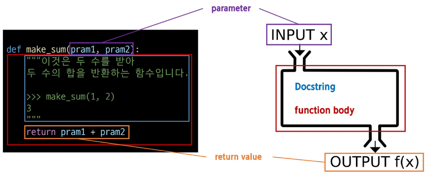

# 7월 17일 TIL

## 1. 함수
- 특정 작업을 수행하기 위한 재사용 가능한 코드 묶음

### 1-1. 함수를 사용하는 이유
- 함수를 정의하고 사용함으로써 코드의 중복을 방지
- **재사용성이** 높아지고, 코드의 **가독성과** **유지보수성** 향상

### 1-2. 함수 구조
```python
def func_name(pram1, pram2) :
  ''' Docstring
  
  '''
  return pram1 + pram2
```


### 1-3. 함수 정의와 호출
- 함수 정의
  - 함수 정의는 def 키워드로 시작
  - def 키워드 이후 함수 이름 작성
  - 괄호안에 매개변수를 정의할 수 있음
  - 매개변수(parameter)는 함수에 전달되는 값을 나타냄

- 함수 body
  - 콜론(:) 다음에 들여쓰기 된 코드 블록
  - 함수가 실행 될 때 수행되는 코드를 정의

- Docstring
  - 함수 body 앞에 선택적으로 작성 가능한 함수 설명서

- 함수 반환 값
  - 함수는 필요한 경우 결과를 반환할 수 있음
  - return 키워드 이후에 반환할 값을 명시
  - return문은 함수의 실행을 종료하고, 결과를 호출 부분으로 반환

- 함수 호출
  - 함수를 사용하기 위해서는 호출이 필요
  - 함수의 이름과 소괄호를 활용해 호출
  - 필요한 경우 인자(argument)를 전달해야 함
  - 호출 부분에서 전달된 인자는 함수 정의 시 작성한 매개변수에 대입됨

## 2. 매개변수와 인자
- 매개변수(Parameter) : 함수를 정의할 때, 함수가 받을 값을 나타내는 변수
- 인자(Argument) : 함수를 호출할 때, 실제로 전달되는 값
  
### 2-1. 매개변수와 인자 예시
```python
def add_numbers(x, y) : # x와 y는 매개변수(parameter)
  result = x + y
  return result

a = 2
b = 3
sum_result = add_numbers(a, b) # a와 b는 인자(arguments)
print(sum_reslut)
```

### 2-2. 인자의 종류
- Positional Arguments(위치인자)
  - 함수 호출 시 인자의 위치에 따라 전달되는 인자
  - 위치인자는 함수 호출 시 반드시 값을 전달해야 함
```python
def greet(name, age) :
  print(f'안녕하세요, {name}님! {age}살이시군요.')

greet('Alice', 25)
```

- Default Argument Values(기본 인자 값)
  - 함수 정의에서 매개변수에 기본 값을 할당하는 것
  - 함수 호출 시 인자를 전달하지 않으면, 기본값이 매개변수에 할당됨
```python
def greet(name, age=30) :
  print(f'안녕하세요, {name}님! {age}살이시군요.')

greet('Bob')
greet('Charlie', 40)
```

- Keyword Arguments(키워드 인자)
  - 함수 호출 시 인자의 이름과 함께 값을 전달하는 인자
  - 매개변수와 인자를 일치시키지 않고, 특정 매개변수에 값을 할당할 수 있음
  - 인자의 순서는 중요하지 않으며, 인자의 이름을 명시하여 전달
  *** 단, 호출 시 키워드 인자는 위치 인자 뒤에 위치해야 함***
```python
def greet(name, age) :
  print(f'안녕하세요, {name}님! {age}살이시군요.)

greet(name='Dave', age =35) # 가능
greet(age=35,'Dave') # 불가능
```

- Arbitrary Argument Lists(임의의 인자 목록)
  - 정해지지 않은 개수의 인자를 처리하는 인자
  - 함수 정의 시 매개변수 앞에 '*'를 붙여 사용하며, 여러 개의 인자를 tuple로 처리
```python
def calculate_sum(*args) :
  print(args)
  total = sum(args)
  print(f'합계 : {total}')

calculate_sum(1, 2, 3)
```

- Arbitrary Keyword Argument Lists(임의의 키워드 인자 목록)
  - 정해지지 않은 개수의 키워드 인자를 처리하는 인자
  - 함수 정의 시 매개변수 앞에 '**'를 붙여 사용하며, 여러 개의 인자를 dicitionary로 묶어 처리
```python
def print_info(**kwargs) :
  print(kwargs)

print_info(name='Eve', age=30) # {'name' : 'Eve', 'age' : 30}
```

### 2-3. 함수 인자 권장 작성순서
- 위치 -> 기본 -> 가변 -> 가변 키워드
- 호출 시 인자를 전달하는 과정에서 혼란을 줄일 수 있도록 함
  
***단, 모든 상황에 적용되는 절대적인 규칙은 아니며, 상황에 따라 유연하게 조정될 수 있음***

## 3. 함수와 Scope

### 3-1. Python의 범위(scope)
- 함수는 코드 내부에 local scope를 생성하며, 그 외의 공간인 global scope로 구분

### 3-2. 범위와 변수 관계

- scope
  - global scope : 코드 어디에서든 참조할 수 있는 공간
  - local scope : 함수가 만든 scope(함수 내부에서만 참조 가능)

- variable
  - global variable : global scope에 정의된 변수
  - local variable : local scope에 정의된 변수

### 3-3. 변수 수명주기(lifecycle)
- 변수의 수명주기는 변수가 선언되는 위치와 scope에 따라 결정됨
  1. bulit-in scope
    - 파이썬이 실행된 이후부터 영원히 유지
  2. global scope
    - 모듈이 호출된 시점 이후 혹은 인터프리터가 끝날 때까지 유지
  3. local scope
    - 함수가 호출될 때 생성되고, 함수가 종료될 때까지 유지

---------------