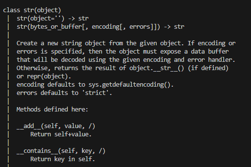

# 7월 22일 TIL

- 데이터 구조(Data Structure)
  - 여러 데이터를 효과적으로 사용, 관리하기 위한 구조  

- 자료 구조
  - 컴퓨터 공학에서는 '자료 구조'라고 함
  - 각 데이터의 효율적인 저장, 관리를 위한 구조를 나눠 놓은 것

- 데이터 구조 활용
  - 문자열, 리스트, 딕셔너리 등 각 데이터 구조의 **메서드**를 호출하여 다양한 기능 활용하기

## 1. 메서드
- 객체에 속한 함수
  - 객체의 상태를 조작하거나 동작을 수행

### 1-1. 메서드 특징
- 메서드는 클래스(class) 내부에 정의되는 함수
- 클래스는 파이썬에서 '타입을 표현하는 방법'이며 이미 은연중에 사용해왔음
- 예를 들어 help 함수를 통해 str을 호출해보면 class였다는 것을 확인 가능

- 메서드는 어딘가(클래스)에 속해 있는 **함수**이며, 각 데이터 타입별로 타입별로 다양한 기능을 가진 메서드가 존재
- 메서드 호출 방법
  - 데이터 타입 객체.메서드()
  ```python
  'hello'.capitalize()
  ```


## 2. 시퀀스 데이터 구조(문자열)

### 2-1. 문자열 조회/탐색 및 검증 메서드

```python
s.find(x) # x의 첫 번째 위치를 반환. 없으면, -1을 반환
s.index(x) # x의 첫 번째 위치를 반환. 없으면, 오류 발생
s.isupper() # 대문자 여부
s.islower() # 소문자 여부
s.isalpha() # 알파벳 문자 여부
```

### 2-2. 문자열 조작 메서드

```python
# .replace(old, new[,count])
# 바꿀 대상 글자를 새로운 글자로 바꿔서 반환
text = 'Hello, world!'
new_text = text.replace('world', 'Python')
print(new_text) # Hello, Python!

# .strip([chars])
# 문자열의 시작과 끝에 있는 공백 혹은 지정한 문자를 제거
text = '  Hello, world!  '
new_text = text.strip()
print(new_text) # 'Hello, world!'

# . split(sep=None, maxsplit=-1)
# 지정한 문자를 구분자로 문자열을 분리하여 문자열의 리스트로 반환
text = 'Hello, world!'
words = text.split(',')
print(words) # ['Hello', ' world!']

# 'separator'.join(iterable)
# iterable의 문자열을 연결한 문자열을 반환
words = ['Hello', 'world!']
text = '-'.join(words)
print(text) # 'Hello-world!
```

## 3. 시퀀스 데이터 구조(리스트)

```python
l.append(x) # 리스트 마지막에 항목 x를 추가
l.extend(m) # iterable m의 모든 항목들을 리스트 끝에 추가
l.insert(i, x) # 리스트 인덱스 i에 항목 x를 삽입
l.remove(x) # 리스트 가장 왼쪽에 있는 항목(첫 번째) x를 제거 항목이 존재하지 않을 경우, ValueError
l.pop() # 리스트 가장 오른쪽에 있는 항목(마지막)을 반환 후 제거
l.pop(i) # 리스트의 인덱스 i에 있는 항목을 반환 후 제거
l.clear() # 리스트의 모든 항목 삭제
l.index(x) # 리스트에서 첫 번째로 일치하는 항목 x의 인덱스를 반환
l.count(x) # 리스트에서 항목 x의 개수를 반환
l.reverse() # 리스트의 순서를 역순으로 변경 (정렬 x)
l.sort() # 리스트를 정렬 (매개변수 이용가능 ex) reverse = True -> 내림차순)
```