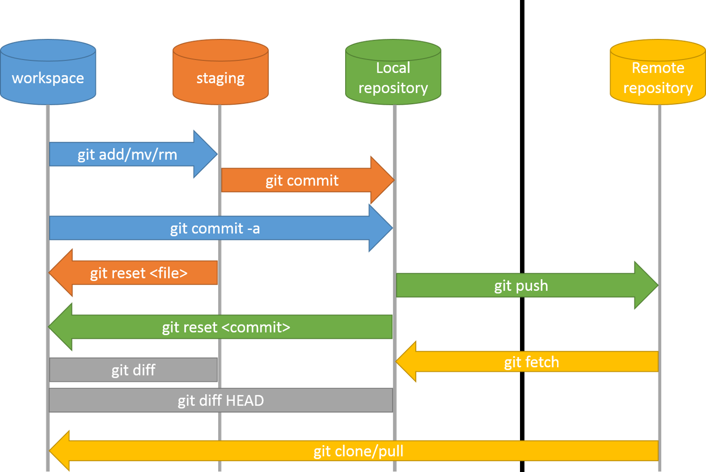

# 7월 11일 TIL
## 1. CIL
- 명령줄 인터페이스(CLI)는 Command-Line Interface 또는 Character User Interface의 줄임말로 글자를 입력하여 컴퓨터에 명령을 내리는 방식
  
- 가장 대표적인 예시로는 DOS, 명령 프롬프트, Bash로 대표되는 Unix 셸 환경이 있다. macOS에서는 Terminal, Windows의 Windows Terminal 등

```
. : 현재 디렉토리
.. : 상위 디렉토리
pwd : 현재 경로
cd : 경로 이동
touch : 파일 생성
mkdir : 디렉토리 생성
cp : 복사
ls : 현재 디렉토리 내 list
rm : 삭제
rmdir : 디렉토리 삭제
```
## 2. git
     깃은 컴퓨터 파일의 변경사항을 추적하고 여러 명의 사용자들 간에 해당 파일들의 작업을 조율하기 위한 스냅샷 스트림 기반의 분산 버전 관리 시스템
    
## 3. git 코드

```linux
git init # 깃 생성
git remote add origin 주소 # 깃 연결
git remote -v # 연결 repo 확인
git config --global user.email "이메일" # 깃 이메일 등록
git config --global user.name "name" # 깃 이름 등록
git status # 깃 상태 확인
git log # 깃 log 확인, git log 탈출 키 = Q
git add . # 변경사항 staging
git commit -m "메세지" : git commit
git push origin master : git 원격저장소로 push
git clone 주소(별칭) : 원격저장소 복제
git pull 주소(별칭) : 원격저장소 pull
```


## 4. 남는 시간
```python
while True :
    try :
        import random
        print('가위 바위 보 게임시작')
        print('종료 입력시 게임 종료')
        print('-------------------')

        a = input('가위 바위 보 선택하세요 :')

        user = 0

        if a == '가위' :
            user = 1
        elif a == '바위' :
            user = 2
        elif a == '보' :
            user = 3
        else : break
        
        rcp_list = [1,2,3]

        computer = random.choice(rcp_list)

        if computer == user :
            print(f' computer : {computer} you : {user} -> 무승부')
        elif (user == 1 and computer == 3) or (user == 2 and computer == 1) or (user == 3 and computer == 2) :
            print(f' computer : {computer} you : {user} -> 승')
        else : print(f' computer : {computer} you : {user} -> 패')
    except Traceback :
        break